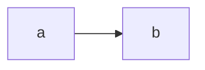

I'm going to test the formatting.

```c++
// This should be a code sample.
int main() {
  std::cout << "Hello?" <<std::endl;
}
```
# H1

## H2

* Single asterisk
* Single Asterisk 2

*Wrapped Asterisk*


