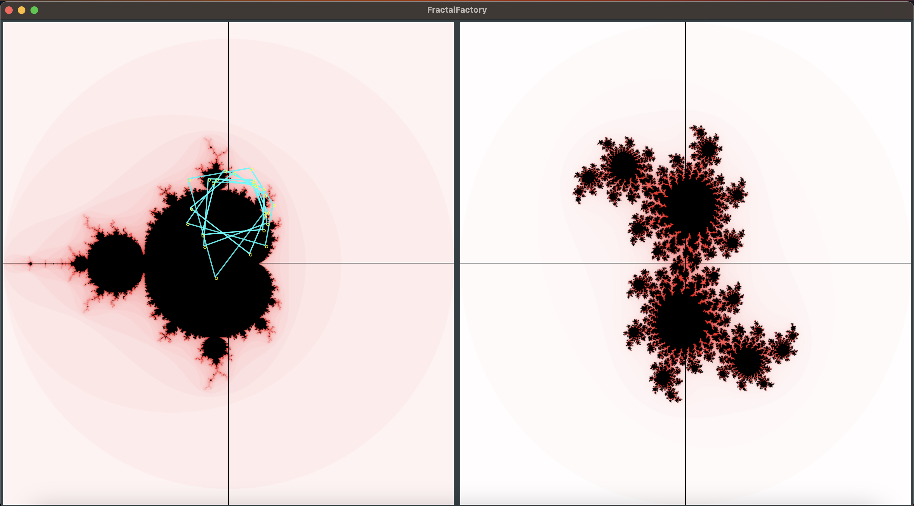

# Coding

## Fractal Factory

I have two versions of this fun little project, one written using Qt and one written using JUCE. The JUCE version is newer and still being worked on, while the Qt project is older and written in a style that I've grown away from. 

Sample Screenshot:

- [Juce Fractal Factory](https://github.com/thomboggs/FractalFactory_JUCE)
- [Qt Fractal Factory](https://github.com/thomboggs/FractalFactory)

### Next Steps 

- Improved multi-threading for quicker calculation.

## Bass Preamp Plugin